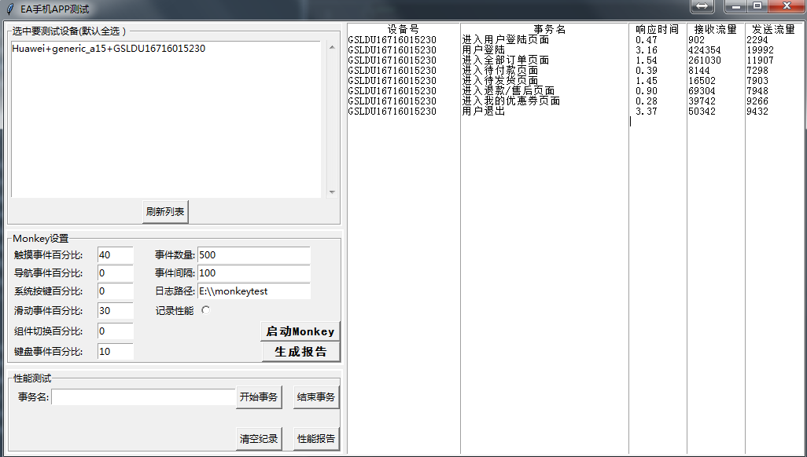
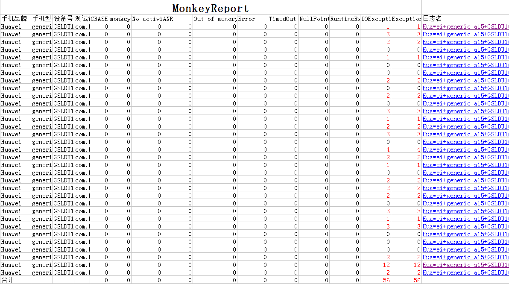
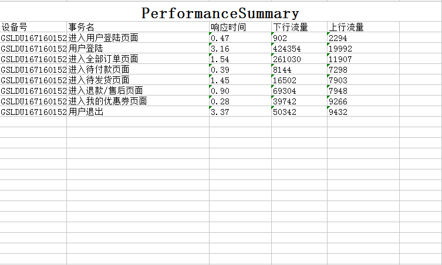
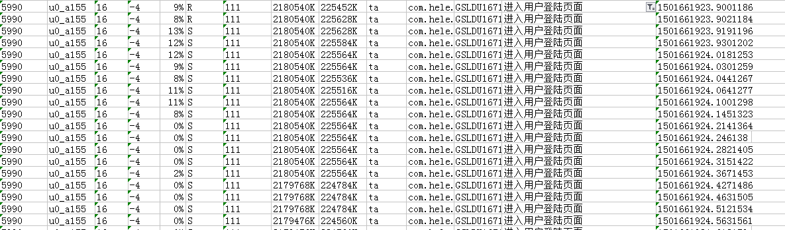

# 安卓手机客户端Monkey及性能测试
## 概述
一直以来都是偏重服务器测的测试,前时间新来了个领导,偏重强调要做客户端的Monkey测试及性能测试,
为了方便组内成员进行相关测试,总参考网上的ADB文档用Python写了一个相关的小工具。主要特点是方便进行批量的Monkey测试与前端性能的事务统计，以统一与后端测试时
的以事务统计性能指标的效果。
## 功能介绍
工具的主要功能
大致总结为：
1. 批量多应用执行Monkey
2. 收集对应的Monkey日志,并解析为Monkey报告方便汇报
3. 批量以事务方式统计前段性能,并收集性能日志解析为性能简报

主要功能下图所示:
 

Monkey报告:
 

性能简报与性能数据(测试期间的性能数据在其它sheet页):
 

性能数据:
 

## 运行环境
1. Windows+Python3.X
2. 安装安卓SDK
3. adb套件
4. 手机正常连接且处于USB调试模式
## 使用说明  
### 启动
1. 用python执行`main.py`
2. 双击`start.bat`

### 参数配置及说明
```
[app]
# 连续测试多个APP包时用逗号隔开
packages = com.hele.buyer
date = 

[monkey]
# Monkey设置,可在界面里设置
default_entry_event_num = 500
default_entry_event_time_sep = 100
default_entry_event_path = E:\\monkeytest
monkey_perf_time_sep = 10
throttle = 100
touch = 30
majornav = 10
syskeys = 10
motion = 30
appswitch = 10
flip = 0

[performance]
# 性能测试
# 测试包名
package = com.hele.buyer
#事务超时10秒时自动结束事务
perf_timeout = 10
# 性能测试中统计事务时敏感度，当CPU使用率大于cpu_percent的次数多于cpu_num开始统计事务时间，
# 当CPU使用率为end_cpu_percent的次数大于end_num结束事务
# 可对不同的机型进行微调
cpu_percent = 10
cpu_num = 2
end_cpu_percent = 2
end_num = 5
```
## 参考资料
主要在网上查询ADB相关的一些资料,地址没有记录
